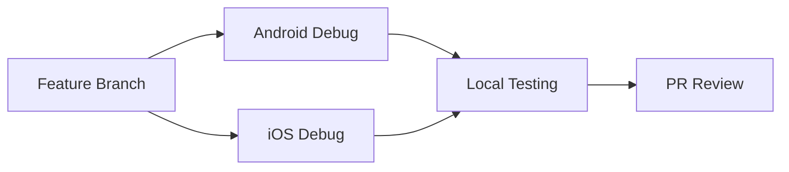
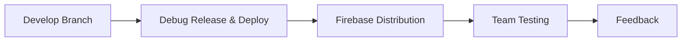
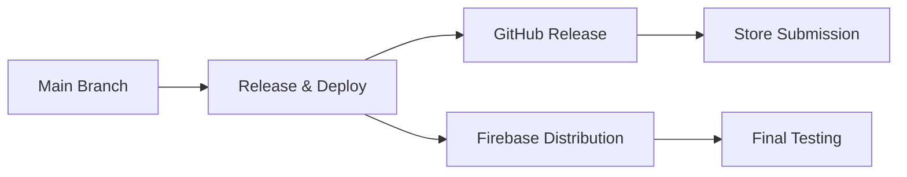

# 🔄 SERA Mobile - Workflows Comparison Guide

## 📋 **Quick Decision Guide**

### 🤔 **أي workflow أستخدم؟**

| السيناريو           | الـ Workflow المُوصى                | السبب               |
| ------------------- | ----------------------------------- | ------------------- |
| 🛠️ تطوير يومي       | Android/iOS Debug                   | سريع وبسيط          |
| 🧪 اختبار مع الفريق | **Debug Release & Deploy**          | توزيع Firebase سريع |
| 📱 إصدار للمختبرين  | Release & Deploy (beta)             | مع توقيع كامل       |
| 🚀 إصدار للإنتاج    | Release & Deploy (production)       | جاهز للـ stores     |
| ⚡ اختبار سريع      | Debug Release & Deploy + skip_tests | أسرع ما يمكن        |

## 📊 **Detailed Comparison**

### 🎯 **Purpose & Use Cases**

| Workflow                   | Primary Purpose | Best For           | Avoid When                      |
| -------------------------- | --------------- | ------------------ | ------------------------------- |
| **Android Debug**          | تطوير Android   | Local testing, PRs | Need iOS, team distribution     |
| **iOS Debug**              | تطوير iOS       | Local testing, PRs | Need Android, team distribution |
| **Android Release**        | إنتاج Android   | Play Store prep    | Need quick testing              |
| **iOS Release**            | إنتاج iOS       | App Store prep     | Need quick testing              |
| **Release & Deploy**       | إنتاج شامل      | Official releases  | Daily development               |
| **Debug Release & Deploy** | اختبار شامل     | Team testing, QA   | Production releases             |

### ⚡ **Performance Metrics**

| Workflow         | Avg Duration | CPU Usage | Cache Efficiency | Best Time        |
| ---------------- | ------------ | --------- | ---------------- | ---------------- |
| Android Debug    | ~3-5 min     | Low       | ✅ High          | Always fast      |
| iOS Debug        | ~5-8 min     | Medium    | ✅ High          | Always fast      |
| Android Release  | ~8-12 min    | Medium    | ✅ High          | With signing     |
| iOS Release      | ~10-15 min   | High      | ✅ High          | With signing     |
| Release & Deploy | ~20-30 min   | High      | ✅ High          | Full process     |
| **Debug R&D**    | ~8-15 min    | Medium    | ✅ High          | **Fastest full** |

### 🔐 **Security & Signing**

| Workflow         | Android Signing   | iOS Signing   | Security Level | Secrets Needed  |
| ---------------- | ----------------- | ------------- | -------------- | --------------- |
| Android Debug    | 🔓 Debug keystore | ❌ N/A        | 🟡 Development | None            |
| iOS Debug        | ❌ N/A            | 🔓 No signing | 🟡 Development | None            |
| Android Release  | 🔐 Production     | ❌ N/A        | 🟢 Production  | Android secrets |
| iOS Release      | ❌ N/A            | 🔐 Production | 🟢 Production  | iOS secrets     |
| Release & Deploy | 🔐 Production     | 🔐 Production | 🟢 Production  | All secrets     |
| **Debug R&D**    | 🔓 Debug keystore | 🔓 No signing | 🟡 Development | Firebase only   |

### 📦 **Outputs & Artifacts**

| Workflow         | Android Output  | iOS Output     | Additional Files     | Retention |
| ---------------- | --------------- | -------------- | -------------------- | --------- |
| Android Debug    | app-debug.apk   | ❌ None        | Basic                | 7 days    |
| iOS Debug        | ❌ None         | .ipa + .app    | dSYM                 | 7 days    |
| Android Release  | app-release.apk | ❌ None        | Signed               | 90 days   |
| iOS Release      | ❌ None         | .ipa + archive | dSYM + archive       | 90 days   |
| Release & Deploy | app-release.apk | .ipa + archive | All + GitHub release | 90 days   |
| **Debug R&D**    | app-debug.apk   | .ipa + archive | All + Debug release  | 30 days   |

### 🔥 **Firebase Distribution**

| Workflow         | Firebase Android | Firebase iOS | Groups                  | Notes                |
| ---------------- | ---------------- | ------------ | ----------------------- | -------------------- |
| Android Debug    | ❌ No            | ❌ No        | -                       | Local only           |
| iOS Debug        | ❌ No            | ❌ No        | -                       | Local only           |
| Android Release  | ❌ No            | ❌ No        | -                       | Manual upload        |
| iOS Release      | ❌ No            | ❌ No        | -                       | Manual upload        |
| Release & Deploy | ✅ Yes           | ✅ Yes       | beta/production-testers | Automatic            |
| **Debug R&D**    | ✅ Yes           | ✅ Yes       | beta-testers            | **Automatic & Fast** |

## 🧪 **Testing Integration**

| Workflow         | Test Execution | Can Skip Tests  | Test Types     | Coverage     |
| ---------------- | -------------- | --------------- | -------------- | ------------ |
| Android Debug    | ❌ No          | ❌ No           | -              | None         |
| iOS Debug        | ❌ No          | ❌ No           | -              | None         |
| Android Release  | ❌ No          | ❌ No           | -              | None         |
| iOS Release      | ❌ No          | ❌ No           | -              | None         |
| Release & Deploy | ✅ Yes         | ✅ Optional     | Unit, Coverage | Full         |
| **Debug R&D**    | ✅ Yes         | ✅ Default Skip | Unit, Coverage | **Optional** |

## 🎛️ **Control & Flexibility**

| Workflow         | Manual Trigger | Auto Trigger        | Input Options                   | Customization |
| ---------------- | -------------- | ------------------- | ------------------------------- | ------------- |
| Android Debug    | ❌ No          | develop, PRs        | None                            | Low           |
| iOS Debug        | ❌ No          | develop, PRs        | None                            | Low           |
| Android Release  | ❌ No          | main, tags          | None                            | Low           |
| iOS Release      | ❌ No          | main, tags          | None                            | Low           |
| Release & Deploy | ✅ Yes         | main, tags          | release_type, notes, skip_tests | High          |
| **Debug R&D**    | ✅ Yes         | develop, feature/\* | **4 options**                   | **Highest**   |

## 💰 **Cost & Resource Usage**

| Workflow         | GitHub Minutes | Storage Usage | Cost Impact             | Frequency |
| ---------------- | -------------- | ------------- | ----------------------- | --------- |
| Android Debug    | ~3-5 min       | Low           | 💰 Cheap                | High      |
| iOS Debug        | ~8-10 min      | Medium        | 💰💰 Medium             | High      |
| Android Release  | ~10-12 min     | Medium        | 💰💰 Medium             | Low       |
| iOS Release      | ~15-20 min     | High          | 💰💰💰 Expensive        | Low       |
| Release & Deploy | ~25-35 min     | High          | 💰💰💰💰 Most Expensive | Very Low  |
| **Debug R&D**    | ~12-18 min     | Medium        | 💰💰 **Cost Effective** | Medium    |

## 📈 **Recommended Usage Patterns**

### 🔄 **Daily Development**



### 🧪 **Weekly Team Testing**



### 🚀 **Monthly Production Release**



## 🎯 **Decision Matrix**

### 📊 **Score each workflow (1-5 scale)**

| Criteria               | Android Debug | iOS Debug | Release & Deploy | **Debug R&D** |
| ---------------------- | ------------- | --------- | ---------------- | ------------- |
| **Speed**              | 5️⃣            | 4️⃣        | 2️⃣               | **4️⃣**        |
| **Distribution**       | 1️⃣            | 1️⃣        | 5️⃣               | **5️⃣**        |
| **Flexibility**        | 2️⃣            | 2️⃣        | 4️⃣               | **5️⃣**        |
| **Cost**               | 5️⃣            | 3️⃣        | 1️⃣               | **3️⃣**        |
| **Security**           | 2️⃣            | 2️⃣        | 5️⃣               | **2️⃣**        |
| **Team Collaboration** | 2️⃣            | 2️⃣        | 5️⃣               | **5️⃣**        |
| **Overall**            | 2.8/5         | 2.3/5     | 3.7/5            | **4.0/5**     |

## 🏆 **Winner: Debug Release & Deploy**

### 🎯 **Why Debug Release & Deploy is the sweet spot:**

1. **⚡ Speed**: Much faster than full Release & Deploy
2. **📱 Distribution**: Automatic Firebase deployment
3. **🔄 Flexibility**: Multiple input options and controls
4. **👥 Team-Friendly**: Perfect for QA and stakeholder testing
5. **💰 Cost-Effective**: Reasonable resource usage
6. **🧪 Testing-Focused**: Built for iteration and feedback

### 🚀 **Best Practices with Debug R&D:**

```bash
# Quick team testing
gh workflow run "release-and-deploy-debug.yml" \
  -f release_type=beta-debug \
  -f skip_tests=true \
  -f deploy_to_firebase=true

# Thorough QA testing
gh workflow run "release-and-deploy-debug.yml" \
  -f release_type=internal-debug \
  -f skip_tests=false \
  -f release_notes="Sprint 23 QA build with new login flow"

# Stakeholder demo
gh workflow run "release-and-deploy-debug.yml" \
  -f release_type=testing-debug \
  -f deploy_to_firebase=true \
  -f release_notes="Demo build for client presentation"
```

---

## 📞 **Need Help Choosing?**

### 🤔 **Still unsure? Ask yourself:**

1. **هل تحتاج توزيع سريع للفريق؟** → Debug Release & Deploy
2. **هل تريد إصدار نهائي للمتاجر؟** → Release & Deploy
3. **هل تختبر محلياً فقط؟** → Individual Debug workflows
4. **هل تحتاج السرعة القصوى؟** → Debug R&D + skip_tests

### 📱 **Contact & Support:**

- 📚 Check individual workflow documentation
- 🔍 Review GitHub Actions logs for issues
- 💬 Ask the development team for guidance
