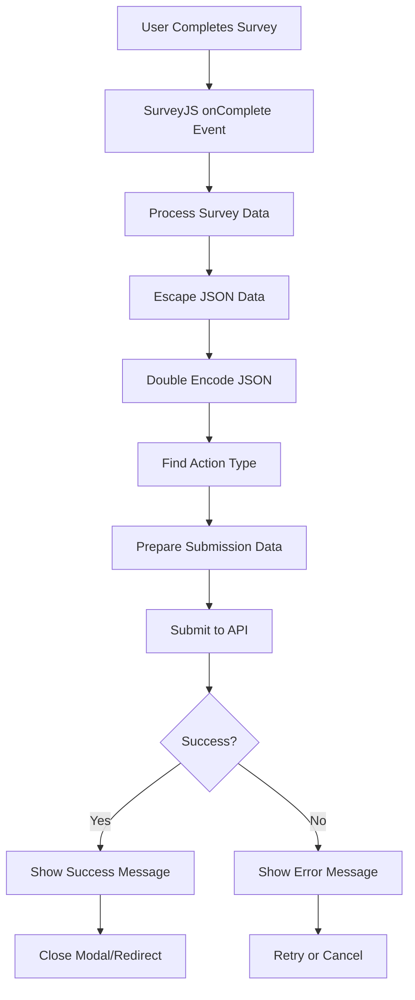

# Complete Survey Submission Logic

## Table of Contents
1. [Overview](#overview)
2. [Survey Response ID Generation](#survey-response-id-generation)
3. [Action Types System](#action-types-system)
4. [Survey Submission Types](#survey-submission-types)
5. [Data Processing & Security](#data-processing--security)
6. [API Endpoints](#api-endpoints)
7. [Survey State Management](#survey-state-management)
8. [Error Handling & User Feedback](#error-handling--user-feedback)
9. [Survey Codes](#survey-codes)
10. [Complete Submission Flow](#complete-submission-flow)
11. [Key Features](#key-features)
12. [Code Examples](#code-examples)

## Overview

The SERA Tawakkalna application implements a comprehensive survey system that supports both standalone surveys (accessed via direct URLs) and embedded surveys (displayed as modals within the application). The system uses the SurveyJS library and integrates with a backend API system for data collection and processing.

## Survey Response ID Generation

### During Complaint Creation

When a complaint is successfully created, the backend automatically generates a survey response ID:

```typescript
const responseData = await submitResponse.json().then((data: any) => {
    if (data.caseId && data.success) {
        setNewCase(data.caseId);
        setSurveyResId(data?.surveyResponseId)  // ← Generated by backend
        setModalShow(true);
    }
});
```

### During Inquiry Creation

Similarly, when an inquiry is created, a survey response ID is generated:

```typescript
const resData = await response.json()
if (resData.success) {
    setInqNum(resData?.inquiryId);
    setSurveyId(resData?.surveyResponseId);  // ← Generated by backend
    setModalShow(true)
}
```

## Action Types System

The system uses predefined action types to track survey states and user interactions:

```typescript
// Fetch action types from backend
axios.get('https://eservicesapiflux.sera.gov.sa/lookupscode/listactiontypes?PageNumber=0&PageSize=0')
    .then(res => {
        setActionType(res?.data?.result);
        // Returns array of action types with ntw_actiontypeid and ntw_name
    })
```

### Common Action Types

| Action Type | Description | Use Case |
|-------------|-------------|----------|
| `"Confirmed"` | User completed survey positively | Final submission |
| `"Rejected"` | User declined to take survey | User cancellation |
| `"Cancelled"` | User started but didn't complete | Abandoned survey |
| `"New Confirm"` | User is progressing through survey | Progressive saving |

## Survey Submission Types

### A. Standalone Survey Submission (SurveyApp.jsx)

#### Final Submission (Complete Survey)

```typescript
const SubmitResult = (sender) => {
    // 1. Process survey data
    const results = escapeDoubleQuotes(JSON.stringify(sender.data));
    const Answers = JSON.stringify(results);
    
    // 2. Find "Confirmed" action type
    let confirmedActionType = '';
    actionTypes?.map((action, key) => {
        if (action?.ntw_name === 'Confirmed') {
            confirmedActionType = action?.ntw_actiontypeid;
        }
    })
    
    // 3. Prepare submission data
    const data = {
        json: Answers,
        actionType: confirmedActionType,  // "Confirmed" action type
        surveyResponse: surveyResponse    // From URL parameter
    };

    // 4. Submit to backend
    axios.post("https://eservicesapiflux.sera.gov.sa/survey/surveyupdatefullsurvey", data)
        .then(res => {
            // Survey completed successfully
        })
        .catch(e => {
            console.error(e?.message);
        });
};

// Register with SurveyJS
survey.onComplete.add(SubmitResult);
```

#### Progressive Submission (Page Changes)

```typescript
const handlePageChanged = (sender) => {
    // 1. Process current page data
    const result = escapeDoubleQuotes(JSON.stringify(sender.data));
    const Answer = JSON.stringify(result);
    
    // 2. Find "New Confirm" action type
    let newConfirmedActionType = '';
    actionTypes?.map((action, key) => {
        if (action?.ntw_name === 'New Confirm') {
            newConfirmedActionType = action?.ntw_actiontypeid;
        }
    })
    
    // 3. Submit progress
    const data = {
        json: Answer,
        actionType: newConfirmedActionType,  // "New Confirm" action type
        surveyResponse: surveyResponse
    };

    axios.post("https://eservicesapiflux.sera.gov.sa/survey/surveyupdatefullsurvey", data)
        .then(res => {
            console.log("Progress saved");
        })
        .catch(e => {
            console.error(e?.message);
        });
};

// Register with SurveyJS
survey.onCurrentPageChanged.add(handlePageChanged);
```

### B. Embedded Survey Submission (Modal Components)

#### EvaluationForm Submission

```typescript
const submittResults2 = (sender: any) => {
    // 1. Process survey data
    let results = escapeDoubleQuotes(JSON.stringify(sender.data));
    results = JSON.stringify(results)
    jsonAns = results;
    
    // 2. Use "Confirmed" action type (index 1)
    actType = actionTypes[1]?.ntw_actiontypeid;
    
    // 3. Submit
    render(1);
};

const render = (code: number) => {
    if (code === 1) {  // Submit survey
        const data = {
            json: jsonAns,
            actionType: actType,
            surveyResponse: props?.surveyId
        }
        
        axios.post("https://eservicesapiflux.sera.gov.sa/survey/updatesurveyresponse", data)
            .then(res => {
                props?.setModalShow(false)
                setModalShow(true);  // Show success message
            }).catch(e => {
                console.log(e?.message);
                setErrorMsg2(e?.message);
            })
    } else if (code === 2) {  // Cancel survey
        const data = {
            json: "",
            actionType: actionTypes[2]?.ntw_actiontypeid,  // "Rejected" action type
            surveyResponse: props?.surveyId
        }
        
        axios.post("https://eservicesapiflux.sera.gov.sa/survey/updatesurveyresponse", data)
            .then(res => {
                props.onHide();
                navigate('/Complaint-menu');
            }).catch(e => {
                console.log(e?.message);
                setErrorMsg3(e?.message);
            })
    }
};

// Register with SurveyJS
survey.onComplete.add(submittResults2);
```

## Data Processing & Security

### A. JSON Escaping

```typescript
function escapeDoubleQuotes(input) {
    return input.replace(/"/g, '\\"');
}
```

**Purpose:** Prevents JSON parsing errors when survey data contains quotes.

### B. Double JSON Encoding

```typescript
// First encoding: SurveyJS data to JSON
const results = JSON.stringify(sender.data);

// Second encoding: Escaped JSON to string
const Answers = JSON.stringify(results);
```

**Why Double Encoding?**
- First encoding: Converts SurveyJS object to JSON string
- Second encoding: Escapes the JSON string for safe transmission
- Backend decodes twice to get original survey data

## API Endpoints

### A. Standalone Surveys
```typescript
POST: https://eservicesapiflux.sera.gov.sa/survey/surveyupdatefullsurvey
```

### B. Embedded Surveys
```typescript
POST: https://eservicesapiflux.sera.gov.sa/survey/updatesurveyresponse
```

**Key Differences:**
- `surveyupdatefullsurvey`: Used for standalone surveys with full survey data
- `updatesurveyresponse`: Used for embedded surveys with response updates

## Survey State Management

### A. Before Unload Handler

```typescript
const handleBeforeUnload = async (event) => {
    event.preventDefault();
    
    // Mark survey as cancelled if user leaves
    const data = {
        json: '',
        actionType: "a4e5ff1d-ee68-ee11-baf4-00155d007258",  // Cancelled
        surveyResponse: surveyResponse
    };

    axios.post("https://eservicesapiflux.sera.gov.sa/survey/surveyupdatefullsurvey", data)
        .then(res => {
            localStorage.setItem('data', 'JSON.stringify(res)')
            console.log("Survey cancelled");
        })
        .catch(e => {
            console.error(e?.message);
        });

    return 'You have unsaved changes. Are you sure you want to leave?';
};
```

### B. Survey Status Validation

```typescript
// Check if survey is active
axios.get(`https://eservicesapiflux.sera.gov.sa/survey/GetStatusFullSurvey?InvitationNumber=${InvitationNumber}`)
    .then((res) => {
        setSurveyResponse(res?.data?.result[0]?.ntw_surveyresponseid);
        setIsActive(res?.data?.result[0]?.statecode === 0);  // 0 = Active
        setInitialDataLoaded(true);
    })
```

## Error Handling & User Feedback

### A. Loading States

```typescript
{initialDataLoaded ? (
    isActive ? (
        questionJson ? (
            <Survey model={survey} />
        ) : (
            !error ? <LoadingSpinner /> : <ErrorMessage />
        )
    ) : null
) : (
    <LoadingSpinner />
)}
```

### B. Success/Error Messages

```typescript
{initialDataLoaded && !isActive && (
    error ? <ErrorMessage /> : <SubmmittedMessage />
)}
```

## Survey Codes

Different survey types use specific codes:

| Survey Type | Code | Description |
|-------------|------|-------------|
| Complaint Evaluation | `SURV-1001` | User feedback on complaint handling |
| Inquiry Evaluation | `SURV-1002` | User feedback on inquiry handling |
| Dynamic Surveys | Variable | Other survey types as needed |

## Complete Submission Flow



## Key Features

1. **Real-time Progress Saving**: Saves survey progress on each page change
2. **Data Integrity**: Double JSON encoding ensures safe data transmission
3. **State Management**: Tracks survey completion status
4. **Error Recovery**: Handles network failures and validation errors
5. **User Experience**: Loading states and success/error feedback
6. **Security**: Input sanitization and proper data escaping
7. **Flexibility**: Supports both standalone and embedded surveys
8. **Internationalization**: Supports Arabic and English languages

## Code Examples

### Complete SurveyApp Component Structure

```typescript
import { Survey } from 'survey-react-ui';
import { Model } from 'survey-core';
import axios from 'axios';

function SurveyApp() {
    const [surveyResponse, setSurveyResponse] = useState();
    const [isActive, setIsActive] = useState(false);
    const [actionTypes, setActionType] = useState("");
    const [questionJson, setQuestionJson] = useState('');
    const [error, setErr] = useState(null);
    const [initialDataLoaded, setInitialDataLoaded] = useState(false);

    // Initialize survey
    useEffect(() => {
        // Check survey status
        axios.get(`https://eservicesapiflux.sera.gov.sa/survey/GetStatusFullSurvey?InvitationNumber=${InvitationNumber}`)
            .then((res) => {
                setSurveyResponse(res?.data?.result[0]?.ntw_surveyresponseid);
                setIsActive(res?.data?.result[0]?.statecode === 0);
                setInitialDataLoaded(true);
            })
    }, [InvitationNumber]);

    // Load action types
    useEffect(() => {
        if (isActive) {
            axios.get('https://eservicesapiflux.sera.gov.sa/lookupscode/listactiontypes?PageNumber=0&PageSize=0')
                .then(res => {
                    setActionType(res?.data?.result);
                })
        }
    }, [isActive]);

    // Load survey questions
    useEffect(() => {
        if (isActive) {
            axios.get(`https://eservicesapiflux.sera.gov.sa/survey/getsurveybycode?SurveyCode=${SurveyCode}`)
                .then((res) => {
                    setQuestionJson(res?.data?.result[0]?.ntw_jsonmetadata);
                })
        }
    }, [isActive, SurveyCode]);

    const survey = new Model(questionJson);

    // Final submission handler
    const SubmitResult = (sender) => {
        const results = escapeDoubleQuotes(JSON.stringify(sender.data));
        const Answers = JSON.stringify(results);
        
        let confirmedActionType = '';
        actionTypes?.map((action) => {
            if (action?.ntw_name === 'Confirmed') {
                confirmedActionType = action?.ntw_actiontypeid;
            }
        });

        const data = {
            json: Answers,
            actionType: confirmedActionType,
            surveyResponse: surveyResponse
        };

        axios.post("https://eservicesapiflux.sera.gov.sa/survey/surveyupdatefullsurvey", data)
            .then(res => {
                // Handle success
            })
            .catch(e => {
                console.error(e?.message);
            });
    };

    // Progressive saving handler
    const handlePageChanged = (sender) => {
        const result = escapeDoubleQuotes(JSON.stringify(sender.data));
        const Answer = JSON.stringify(result);
        
        let newConfirmedActionType = '';
        actionTypes?.map((action) => {
            if (action?.ntw_name === 'New Confirm') {
                newConfirmedActionType = action?.ntw_actiontypeid;
            }
        });

        const data = {
            json: Answer,
            actionType: newConfirmedActionType,
            surveyResponse: surveyResponse
        };

        axios.post("https://eservicesapiflux.sera.gov.sa/survey/surveyupdatefullsurvey", data);
    };

    // Register event handlers
    survey.onComplete.add(SubmitResult);
    survey.onCurrentPageChanged.add(handlePageChanged);

    return (
        <div className='mainC out-app-survey'>
            {initialDataLoaded ? (
                isActive ? (
                    questionJson ? (
                        <Survey model={survey} />
                    ) : (
                        !error ? <LoadingSpinner /> : <ErrorMessage />
                    )
                ) : null
            ) : (
                <LoadingSpinner />
            )}
            {initialDataLoaded && !isActive && (
                error ? <ErrorMessage /> : <SubmmittedMessage />
            )}
        </div>
    );
}
```

### Embedded Survey Modal Example

```typescript
const EvaluationForm = (props: any) => {
    const [questionJson, setQuestionJson] = useState<any>('');
    const survey = new Model(questionJson);
    const [actionTypes, setActionType] = useState<any>("");
    const [modalShow, setModalShow] = useState<boolean>(false);

    // Load action types
    useEffect(() => {
        props?.surveyId && axios.get('https://eservicesapiflux.sera.gov.sa/lookupscode/listactiontypes?PageNumber=0&PageSize=0')
            .then(res => {
                setActionType(res?.data?.result);
            })
    }, [props?.surveyId]);

    // Load survey questions
    useEffect(() => {
        props?.surveyId && axios.get("https://eservicesapiflux.sera.gov.sa/survey/getsurveybycode?SurveyCode=SURV-1001")
            .then((res) => {
                setQuestionJson(res?.data?.result[0]?.ntw_jsonmetadata)
            })
    }, [props?.surveyId]);

    let jsonAns = "";
    let actType = "";

    const submittResults2 = (sender: any) => {
        let results = escapeDoubleQuotes(JSON.stringify(sender.data));
        results = JSON.stringify(results)
        jsonAns = results;
        actType = actionTypes[1]?.ntw_actiontypeid;
        render(1);
    };

    const render = (code: number) => {
        if (code === 1) {
            const data = {
                json: jsonAns,
                actionType: actType,
                surveyResponse: props?.surveyId
            }
            
            axios.post("https://eservicesapiflux.sera.gov.sa/survey/updatesurveyresponse", data)
                .then(res => {
                    props?.setModalShow(false)
                    setModalShow(true);
                }).catch(e => {
                    console.log(e?.message);
                })
        }
    };

    survey.onComplete.add(submittResults2);

    return (
        <Modal {...props} size="lg" centered>
            <Modal.Body>
                <div className='survey in-app-survey'>
                    <Survey model={survey} />
                </div>
            </Modal.Body>
            <SuccessfulMessage
                show={modalShow}
                onHide={() => setModalShow(false)}
            />
        </Modal>
    );
};
```

---

**Note:** This documentation covers the complete survey submission logic implemented in the SERA Tawakkalna application. The system is designed to be robust, secure, and user-friendly while maintaining data integrity throughout the survey process. 