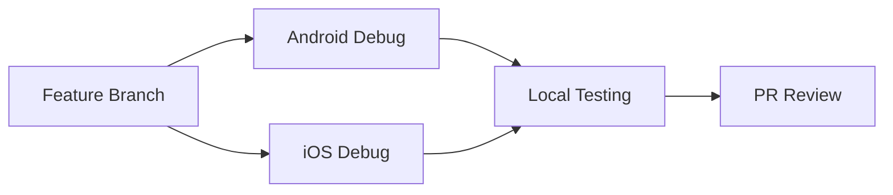
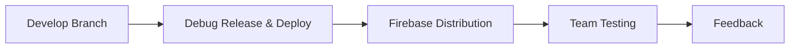
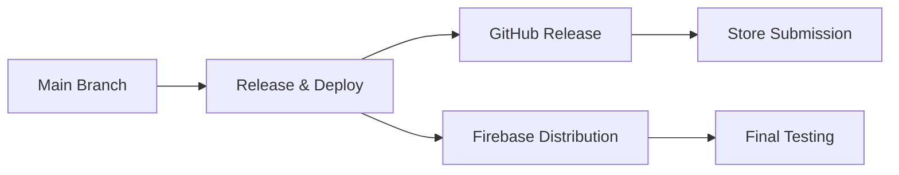

# 🚀 SERA Mobile CI/CD Complete Guide

## 📊 Current Status (✅ Completed)

### Core Workflows

- ✅ Android Debug/Release builds
- ✅ iOS Debug/Release builds
- ✅ Platform selection (both/android-only/ios-only)
- ✅ Firebase App Distribution
- ✅ GitHub Releases automation
- ✅ Skip tests option
- ✅ Error handling & fallbacks

### Infrastructure

- ✅ GitHub Actions permissions setup
- ✅ Android keystore configuration
- ✅ iOS code signing troubleshooting
- ✅ Multi-attempt export strategies
- ✅ Comprehensive documentation

---

## 🔄 Workflows Comparison & Decision Guide

### 🤔 Which workflow should I use?

| Scenario               | Recommended Workflow                | Reason                      |
| ---------------------- | ----------------------------------- | --------------------------- |
| 🛠️ Daily development   | Android/iOS Debug                   | Fast and simple             |
| 🧪 Team testing        | **Debug Release & Deploy**          | Quick Firebase distribution |
| 📱 Release for testers | Release & Deploy (beta)             | With full signing           |
| 🚀 Production release  | Release & Deploy (production)       | Ready for stores            |
| ⚡ Quick testing       | Debug Release & Deploy + skip_tests | Fastest possible            |

### 📊 Detailed Comparison

| Workflow         | Avg Duration | Purpose             | Best For           | Firebase Distribution |
| ---------------- | ------------ | ------------------- | ------------------ | --------------------- |
| Android Debug    | ~3-5 min     | Android development | Local testing, PRs | ❌ No                 |
| iOS Debug        | ~5-8 min     | iOS development     | Local testing, PRs | ❌ No                 |
| Android Release  | ~8-12 min    | Android production  | Play Store prep    | ❌ No                 |
| iOS Release      | ~10-15 min   | iOS production      | App Store prep     | ❌ No                 |
| Release & Deploy | ~20-30 min   | Full production     | Official releases  | ✅ Yes                |
| **Debug R&D**    | ~8-15 min    | Fast testing        | **Team testing**   | **✅ Yes**            |

### 🏆 Winner: Debug Release & Deploy

**Why it's the sweet spot:**

1. **⚡ Speed**: Much faster than full Release & Deploy
2. **📱 Distribution**: Automatic Firebase deployment
3. **🔄 Flexibility**: Multiple input options and controls
4. **👥 Team-Friendly**: Perfect for QA and stakeholder testing
5. **💰 Cost-Effective**: Reasonable resource usage
6. **🧪 Testing-Focused**: Built for iteration and feedback

---

## 🗺️ Future Development Roadmap

### Phase 1: Notifications and Version Management (High Priority)

#### 🔔 Notification System

**Duration**: 2-3 days | **Benefits**: Immediate team communication

```yaml
Features:
  - Slack integration for build notifications
  - Discord webhooks support
  - Microsoft Teams integration
  - Email notifications
  - Custom notification templates
  - Success/failure/warning alerts
```

#### 📊 Version Management

**Duration**: 3-4 days | **Benefits**: Professional version control

```yaml
Features:
  - Semantic versioning (Major.Minor.Patch)
  - Automatic build number increment
  - Git tag creation
  - Version comparison
  - Changelog generation
  - Release notes automation
```

#### 🏪 App Store Deployment

**Duration**: 5-7 days | **Benefits**: Automatic deployment to stores

```yaml
Features:
  - Google Play Console upload
  - Apple App Store Connect integration
  - Beta track management
  - Release track promotion
  - Automated metadata updates
  - Screenshot updates
```

### Phase 2: Security and Quality (Medium-High Priority)

#### 🛡️ Security & Quality Assurance

**Duration**: 4-5 days | **Benefits**: Ensure code security and quality

```yaml
Features:
  - Dependency vulnerability scanning (npm audit, Snyk)
  - Code quality checks (ESLint, Prettier)
  - SonarQube integration
  - License compliance checking
  - SAST (Static Application Security Testing)
  - Security badge generation
```

#### 🧪 Enhanced Testing Framework

**Duration**: 4-6 days | **Benefits**: Comprehensive app testing

```yaml
Features:
  - E2E testing with Detox (React Native)
  - Visual regression testing
  - Performance testing
  - Accessibility testing
  - Device farm integration
  - Test result visualization
```

### Phase 3: Performance Optimization and Environments (Medium Priority)

#### ⚡ Performance Optimization

**Duration**: 3-4 days | **Benefits**: Faster and more efficient builds

```yaml
Features:
  - Build time monitoring & analytics
  - Advanced caching strategies
  - Parallel job execution
  - Resource usage optimization
  - Build performance dashboard
  - Bottleneck identification
```

#### 🌍 Multi-Environment Support

**Duration**: 4-5 days | **Benefits**: Multi-environment management

```yaml
Features:
  - Development/Staging/Production configs
  - Environment-specific variables
  - Conditional deployment logic
  - Environment health checks
  - Config validation
  - Environment comparison tools
```

### Phase 4: Monitoring and Analytics (Low-Medium Priority)

#### 📈 Analytics & Monitoring

**Duration**: 3-4 days | **Benefits**: Deep performance insights

```yaml
Features:
  - Build success/failure rates
  - Performance metrics tracking
  - Usage analytics
  - Cost analysis
  - Trend visualization
  - Custom dashboards
```

#### 🔄 Rollback & Recovery

**Duration**: 2-3 days | **Benefits**: Quick recovery from issues

```yaml
Features:
  - One-click rollback workflows
  - Automated health checks
  - Canary deployments
  - Blue-green deployments
  - Recovery automation
  - Incident response workflows
```

## 📊 Priority Decision Matrix

| Feature            | Business Impact | Ease of Execution | Priority | Duration |
| ------------------ | --------------- | ----------------- | -------- | -------- |
| Notifications      | 🔥 High         | 🟢 Easy           | P1       | 2-3 days |
| Version Management | 🔥 High         | 🟡 Medium         | P1       | 3-4 days |
| App Store Deploy   | 🔥 High         | 🔴 Hard           | P1       | 5-7 days |
| Security Scanning  | 🔥 High         | 🟡 Medium         | P2       | 4-5 days |
| Enhanced Testing   | 🟡 Medium       | 🔴 Hard           | P2       | 4-6 days |
| Performance Opt    | 🟡 Medium       | 🟡 Medium         | P3       | 3-4 days |
| Multi-Environment  | 🟡 Medium       | 🟡 Medium         | P3       | 4-5 days |

## 🎯 Recommendations for Starting

### For Production Projects:

1. **🔔 Notification System** - Start with Slack integration
2. **📊 Version Management** - Essential for any project
3. **🏪 App Store Deployment** - For reaching users

### For Small Teams:

1. **🛡️ Security Scanning** - Basic security
2. **⚡ Performance Optimization** - Time and resource savings
3. **🔄 Rollback Mechanism** - Additional security

### For Large Projects:

1. **🌍 Multi-Environment Support** - Essential for large teams
2. **📈 Analytics & Monitoring** - Insights for improvement
3. **🧪 Enhanced Testing** - Quality assurance

## 📈 Recommended Usage Patterns

### 🔄 Daily Development



### 🧪 Weekly Team Testing



### 🚀 Monthly Production Release



## 🚀 Best Practices with Debug Release & Deploy

```bash
# Quick team testing
gh workflow run "release-and-deploy-debug.yml" \
  -f release_type=beta-debug \
  -f skip_tests=true \
  -f deploy_to_firebase=true

# Thorough QA testing
gh workflow run "release-and-deploy-debug.yml" \
  -f release_type=internal-debug \
  -f skip_tests=false \
  -f release_notes="Sprint 23 QA build with new login flow"

# Stakeholder demo
gh workflow run "release-and-deploy-debug.yml" \
  -f release_type=testing-debug \
  -f deploy_to_firebase=true \
  -f release_notes="Demo build for client presentation"
```

## 💰 Cost & Resource Analysis

| Workflow         | GitHub Minutes | Storage Usage | Cost Impact             | Frequency |
| ---------------- | -------------- | ------------- | ----------------------- | --------- |
| Android Debug    | ~3-5 min       | Low           | 💰 Cheap                | High      |
| iOS Debug        | ~8-10 min      | Medium        | 💰💰 Medium             | High      |
| Android Release  | ~10-12 min     | Medium        | 💰💰 Medium             | Low       |
| iOS Release      | ~15-20 min     | High          | 💰💰💰 Expensive        | Low       |
| Release & Deploy | ~25-35 min     | High          | 💰💰💰💰 Most Expensive | Very Low  |
| **Debug R&D**    | ~12-18 min     | Medium        | 💰💰 **Cost Effective** | Medium    |

## 📞 Next Steps

**Tell me which feature you want to start with and I'll start developing it right away!**

### I recommend starting with:

```bash
# The fastest and most beneficial:
1. 🔔 Notification System (Slack)
2. 📊 Version Management
3. 🛡️ Security Scanning

# Or tell me your specific priorities!
```

## 🤔 Need Help Choosing?

### Still unsure? Ask yourself:

1. **Do you need quick team distribution?** → Debug Release & Deploy
2. **Do you want a final release for stores?** → Release & Deploy
3. **Are you testing locally only?** → Individual Debug workflows
4. **Do you need maximum speed?** → Debug R&D + skip_tests

---

**📅 Last Updated**: December 2024  
**📊 Overall Progress**: 40% Completed | 60% Planned
